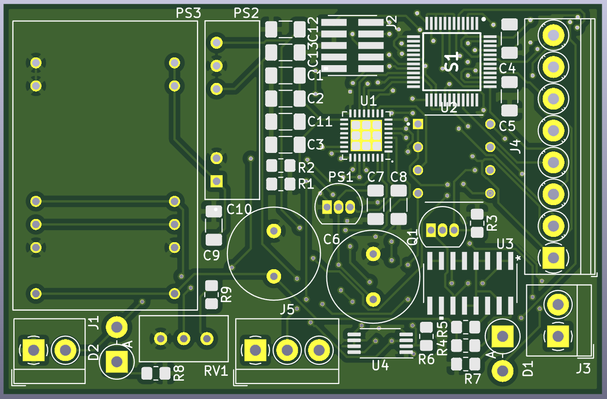
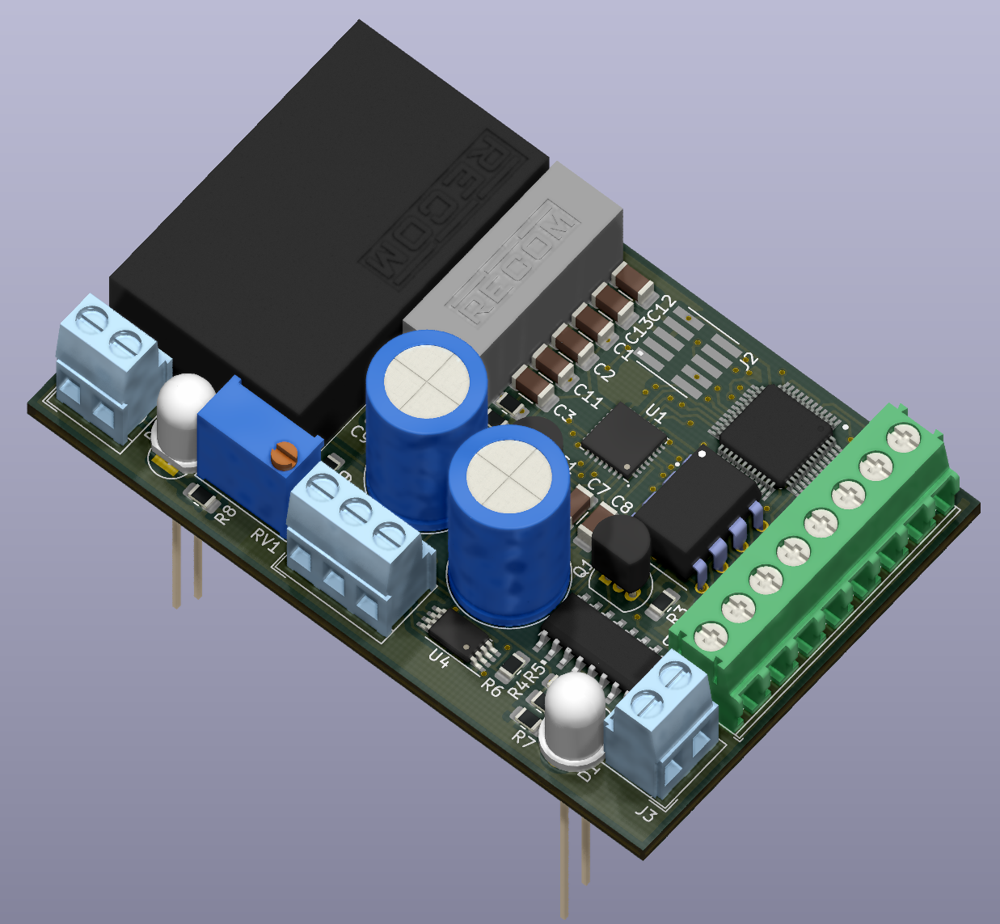
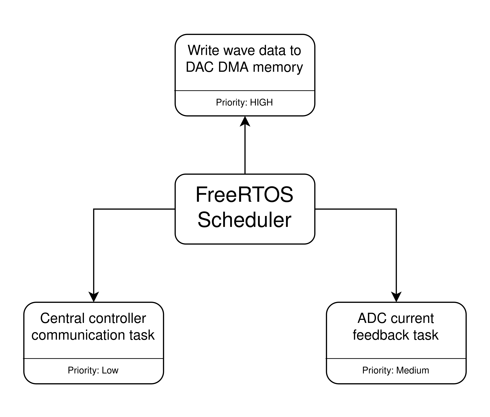
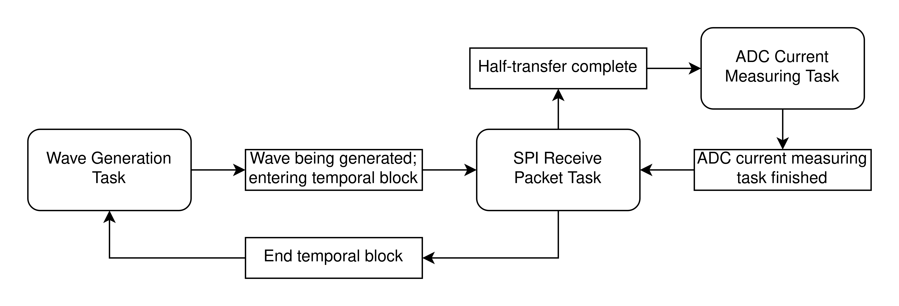

# FES-Controller
### Thesis Project by Ahmed Hafeez-Baig
## Overview
Please find in this repository the firmware and hardware required for an FES controler, designed as an submodule to existing rehabilitation systems. The firmware is designed to have a high capacity for external communication, such that the FES submodule designed can communicate with existing systems.

*Note: Schematic is currently unavailable, will become available once IP rights has been confirmed.*

## Hardware

PCB:

Schematic:

BOM:
| Schematic Reference 	| Item                            	| Quantity 	| Cost (Individual) 	| Cost (Total) 	|
|---------------------	|---------------------------------	|----------	|-------------------	|--------------	|
| R1                  	| 10k (5%) SMD Resistor (0805)    	| 1        	| $0.176            	| 0.176        	|
| R3,R7,R8            	| 100 (5%) SMD Resistor (0805)    	| 3        	| $0.743            	| 2.229        	|
| R4,R5               	| 10 (5%) SMD Resistor (0805)     	| 2        	| $0.135            	| 0.270        	|
| R6                  	| 1 (5%) SMD Resistor (0805)      	| 1        	| $0.297            	| 0.297        	|
| R9                  	| 3.6k (5%) SMD Resistor (0805)   	| 1        	| $0.176            	| 0.176        	|
| RV1                 	| 2K Potentiometer (3296W)        	| 1        	| $2.350            	| 2.350        	|
| C1,C2,C3,C4,C7,C14  	| 0.1u (20%) SMD Capacitor (1206) 	| 6        	| $0.176            	| 1.056        	|
| C5                  	| 4.7n (10%) SMD Capacitor (0603) 	| 1        	| $0.621            	| 0.621        	|
| C6,C10              	| 470uF Electrolytic Capacitor    	| 2        	| $2.160            	| 4.320        	|
| C8                  	| 1u (10%) SMD Capacitor (1206)   	| 1        	| $0.203            	| 0.203        	|
| C9,C11,C12,C13      	| 10u (10%) SMD Capacitor (1206)  	| 4        	| $0.311            	| 1.244        	|
| U1                  	| STM32L432KB                     	| 1        	| $8.140            	| 8.140        	|
| U2                  	| TL072                           	| 1        	| $1.730            	| 1.730        	|
| U3                  	| MMPQ2907A                       	| 1        	| $2.520            	| 2.520        	|
| U4                  	| INA240A3PW                      	| 1        	| $4.670            	| 4.670        	|
| Q1                  	| BC547B                          	| 1        	| $0.648            	| 0.648        	|
| S1                  	| HV2601                          	| 1        	| $28.620           	| 28.620       	|
| PS1                 	| MCP1700-3302E                   	| 1        	| $0.581            	| 0.581        	|
| PS2                 	| RH-0515D                        	| 1        	| $11.110           	| 11.110       	|
| PS3                 	| R05-100B                        	| 1        	| $65.160           	| 65.160       	|
| J1,J3               	| Screw Terminal (x2)             	| 2        	| $1.320            	| 2.640        	|
| J2                  	| J-Link Header                   	| 1        	| $0.851            	| 0.851        	|
| J4                  	| Screw Terminal (x8)             	| 1        	| $8.880            	| 8.880        	|
| J5                  	| Screw Terminal (x3)             	| 1        	| $2.000            	| 2.000        	|
|                     	|                                 	|          	| Total Cost        	| 150.492      	|

## Firmware

The firmware for the project uses FreeRTOS to run all wave generation and external communication tasks.

Firmware Overview:

Task Transitions Overview:

